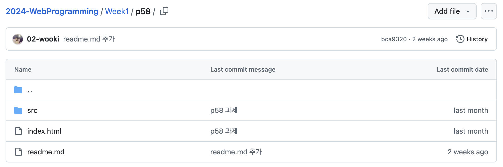
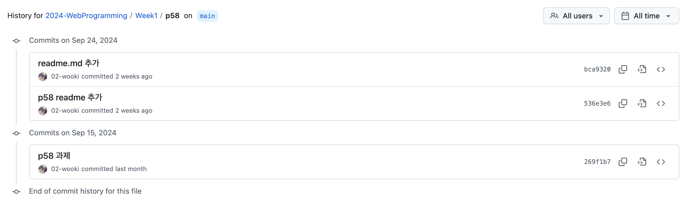
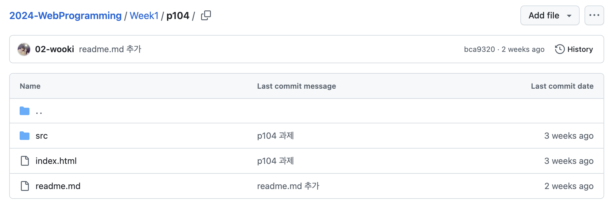
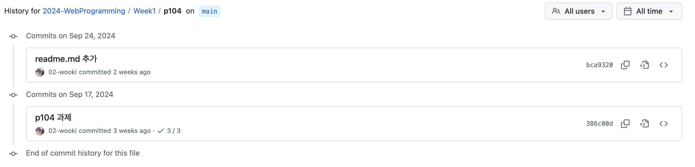

# 2024년 2학기 웹 프로그래밍 과제

### 작성
- 이름: 성현욱
- 학번: 2021763040

## Week1
2024년 9월 10일 수업내용을 바탕으로 과제 작성

- Week1 폴더 내에 readme.md 작성 후 커밋하여 폴더 전체 커밋 날짜가 최신화된 이슈 발생..

^ Week1/p58

^ Week1/p104

- 위 사진은 2024년 10월 10일 기준으로, 두 폴더 모두 index.html과 src 폴더는 9월 17일 이전 수정인 것을 알 수 있음

## Week2
2024년 9월 24일 수업내용을 바탕으로 과제 작성